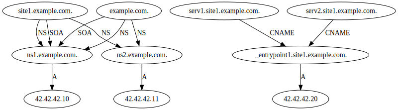

PyDnsViz
========



Usage
-----

To generate the previous graph, run the following command:
```bash
pydnsviz --zone-file site1.example.com --zone-file-path ./data/zones/db.site1.example.com --zone-file example.com --zone-file-path ./data/zones/db.example.com
```

Installation
------------

```
#Install from pip
sudo pip3 install pydnsviz
#Install from sources
sudo ./setup.py install
```
